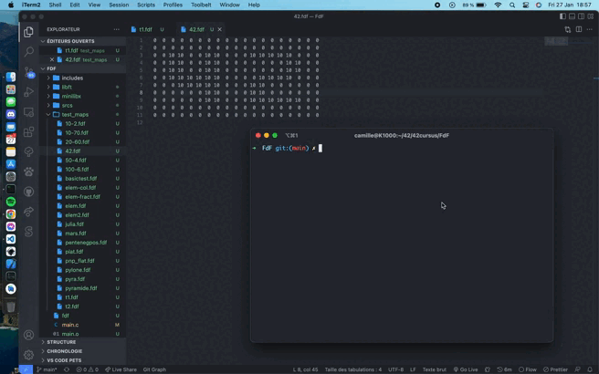

<div align="center">

# FdF
#### Wireframe mdoel
[](https://forthebadge.com)

</div>

Seventh project for [42 school](https://42.fr/en/homepage/). The aim is to display an isometric representation of a landscape given as parameter
<div align="center">


</div>

## Subject

The only constraints are the following:
- use [MinilibX](https://github.com/42Paris/minilibx-linux)
- display an isometric representation of the map given as parameter

## Usage

```bash
./fdf path_to_fdf_map
```

## Useful links

[wikipedia page of the Bresenham's line algorithm](https://en.wikipedia.org/wiki/Bresenham%27s_line_algorithm)  
[MinilibX 42 documentation](https://harm-smits.github.io/42docs/libs/minilibx)  
[This awesome explanation about mlx hooks and events](https://gist.github.com/KokaKiwi/4052375)